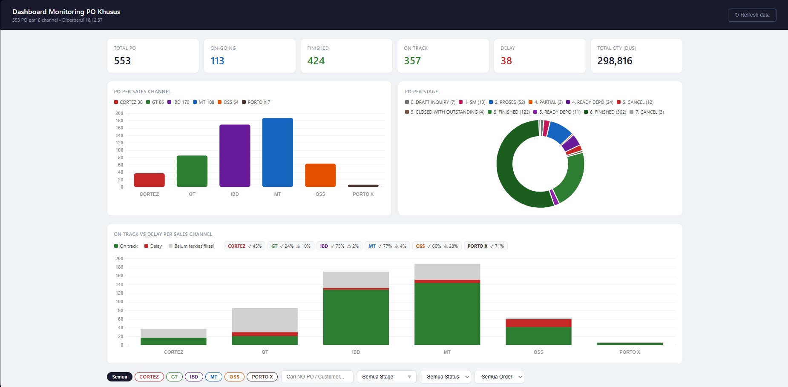

# 📊 Dashboard Monitoring PO Khusus

Dashboard interaktif berbasis HTML + JavaScript untuk monitoring Purchase Order (PO) khusus secara real-time, terintegrasi langsung dengan Google Sheets melalui Apps Script API.

---

## 🖼️ Preview



---

## 🚀 Features

### 📈 Summary Metrics

* Total PO
* On-going vs Finished
* On Track vs Delay
* Total Quantity (Dus)

---

### 📊 Visual Analytics

* **PO per Sales Channel** (Bar Chart)
* **PO per Stage** (Doughnut Chart)
* **On Track vs Delay per Channel** (Stacked Bar)
* **Alokasi SKU per Plant** (Bar Chart)

---

### 🔍 Advanced Filtering

* Filter by:

  * Sales Channel
  * Stage (multi-select dropdown)
  * Pareto Status (ON TRACK / DELAY)
  * Order Status (Done / Progress / Waiting)
  * Date Range (Revisi Stuffing)
* Search by:

  * No PO
  * Customer

---

### 📋 Table & Detail View

* Paginated PO table
* Click row → open modal detail:

  * Qty PO vs Delivery
  * Fulfillment Rate
  * SKU breakdown
  * Plant allocation
  * Reason aggregation

---

## 🧠 Data Processing Logic

### Grouping Strategy

Data dari Google Sheets di-aggregate per:

```
CHANNEL + NO PO
```

### Aggregated Fields

* Total Qty PO (Dus)
* Total Qty Delivery (Dus)
* Stage & Status
* Merged Reason (unique)
* SKU-level detail
* Plant allocation per PO

---

## ⚙️ Tech Stack

* Vanilla JavaScript (no framework)
* Chart.js (visualization)
* Google Apps Script (API layer)
* Google Sheets (data source)

---

## 🔌 Data Source

Endpoint:

```
https://script.google.com/macros/s/AKfycbyo5y8mS6FJC8UY5UHnW_uD4QnjqceRhjUgbctUz7N4srKb6-L_BkmHe6hhIMWzfKj3eA/exec
```

### Requirement:

* Apps Script sudah deploy sebagai Web App
* Access: **Anyone**
* Return format: JSON array

---

## 📁 File Structure

```
index.html
```

Single file berisi:

* HTML (structure)
* CSS (styling)
* JavaScript (logic, data processing, chart)

---

## ⚡ Performance Notes

* Chart menggunakan `update()` (tidak recreate)
* Data aggregation dilakukan sekali saat load
* Filtering berbasis in-memory (cepat)
* Pagination untuk handle dataset besar

---

## 🧪 Known Limitations

* Belum ada debounce pada search
* Semua data di-load di awal (belum server-side)
* Tidak ada caching API

---

## 💡 Future Improvement

* Debounce search input
* Cache API response
* Virtual scrolling
* Export ke Excel
* Integrasi ke ERP (Odoo API)

---

## 👨‍💻 Author

Wahyu Aji L - SCM

---

## 🧠 Notes

Dashboard ini dibuat untuk kebutuhan operasional PPIC / SCM:

* Monitoring PO real-time
* Identifikasi delay
* Visibility workload per plant
